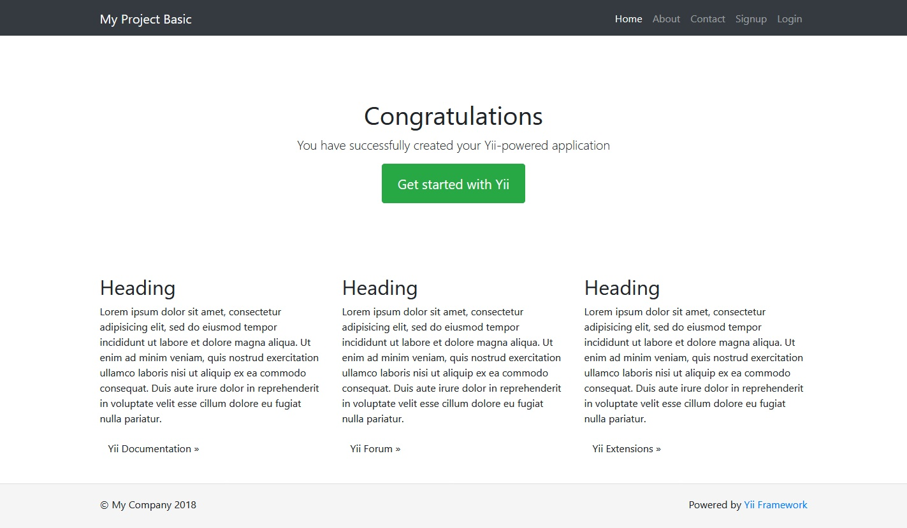

<p align="center">
    <a href="https://github.com/terabytesoft/app-basic" target="_blank">
        
    </a>
    <h1 align="center">Yii 3.0 Web Application Basic</h1>
    <br>
</p>

[](https://www.yiiframework.com/)
[](https://scrutinizer-ci.com/g/terabytesoft/app-basic/build-status/master)
[](https://scrutinizer-ci.com/g/terabytesoft/app-basic/?branch=master)
[](https://scrutinizer-ci.com/code-intelligence)
[](https://codeclimate.com/github/terabytesoft/app-basic/maintainability)
[](https://packagist.org/packages/cjtterabytesoft/app)


App Web Application Basic of Yii Version 3.0 [Yii Framework](http://www.yiiframework.com/) application best for rapidly creating projects with Bootstrap 4.





The template contains the basic features including:

- [x] Pages - [Screenshots]:
    - [about](docs/images/about.jpg)
    - [contact](docs/images/contact.jpg)


- [x] User Functions - [Screenshots]:
    - [signup](docs/images/signup.png)
    - [login](docs/images/login.jpg)
    - [request password reset](docs/images/request-paswword-reset.jpg)
    - [reset password](docs/images/reset-password.jpg)
    - [logout](docs/images/logout.jpg)

It includes all commonly used configurations that would allow you to focus on adding new
features to your application.

DIRECTORY STRUCTURE
-------------------

```
config/             contains application configurations
docs/               contains documentation app-basic
src/
  assets/           contains assets definition
  commands/         contains console commands (controllers)
  controllers/      contains Web controller classes
  forms/            contains models forms classes  
  mail/             contains view files for e-mails
  messages/         contains messages translate application 
  models/           contains model classes
  views/            contains view files for the Web application
tests/              contains various tests for the basic application
vendor/             contains dependent 3rd-party packages
```

REQUIREMENTS
------------
 
The minimum requirement by this project template that your Web server supports PHP 7.1.

INSTALLATION
------------

If you do not have [Composer](http://getcomposer.org/), you may install it by following the instructions
at [getcomposer.org](http://getcomposer.org/doc/00-intro.md#installation-nix).

You can then install this project template using the following command:

~~~
composer create-project --prefer-dist --stability=dev terabytesoft/app-template-basic myapp
~~~

Now you should be able to access the application through the following URL, assuming `public` is the directory
directly under the Web root.

**App Web Application Basic (terabytesoft/app-basic) is installed automatically together with the Web Project Skeleton Application Basic (terabytesoft/app-template-basic), both try the necessary packages to start your Web Application Basic in Yii3.** 

~~~
http://localhost/
~~~

CONFIGURATION
-------------

### APP-BASIC SETUP DEFAULT:

- [config/common.php](config/common.php)

- [config/console.php](config/console.php)

- [config/env.php](config/env.php)

- [config/messages.php](config/messages.php)

- [config/params.php](config/params.php)

- [config/web.php](config/web.php)

### WEB SERVER SUPPORT:

- Apache.
- Nginx.
- OpenLiteSpeed.

[DOCUMENTATION STYLE GUIDE](docs/DOCUMENTATION.md)

**LICENSE:**

[](https://packagist.org/packages/cjtterabytesoft/app)


**NOTES:**

- Check and edit the other files in the `config/` directory to customize your application as required.
